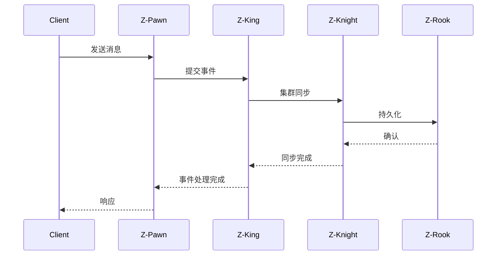

# Z-Chess 架构文档

## 系统架构

Z-Chess 是一个面向IoT场景的高性能通讯服务，内建基于Raft协议的分布式一致性集群。

## 模块划分

### Z-King
事件处理组件，提供基于Disruptor的事件处理框架
- 文件数: 109
- 主要类: MetricsRegistry, ZChessMetrics, ZUID, JsonUtil, CryptoUtil

### Z-Queen
核心服务组件
- 文件数: 126
- 主要类: InnerProtocol, DecodedDispatcher, IoDispatcher, EncodedHandler, WriteDispatcher

### Z-Rook
存储组件
- 文件数: 24
- 主要类: BFS, DFS, GEdge, GNode, RookSource

### Z-Bishop
消息处理组件
- 文件数: 170
- 主要类: ProtocolContext, SharedSubscriptionManagerImpl, MessageExpiryHandler, SharedSubscription, LastWillHandler

### Z-Knight
集群组件，实现Raft协议
- 文件数: 80
- 主要类: SchedulerServiceImpl, DefaultSchedulerEngine, BaseRetryPolicy, RoundRobinLoadBalancePolicy, LongToDataSizeConverter

### Z-Pawn
客户端组件
- 文件数: 47
- 主要类: DeviceNode, PawnIoConfig, MixCoreConfig, MqttConfig, MqttFeatureConfig

### Z-Player
播放器组件
- 文件数: 52
- 主要类: WebSocketConfig, JpaConfig, BusinessScheduler, PushService, Message

### Z-Audience
观察者组件
- 文件数: 94
- 主要类: ApplicationAudience, IoConsumerConfig, AudienceCacheConfig, ClientConfig, SocketConfig

### Z-Arena
竞技场/测试组件
- 文件数: 3
- 主要类: ApplicationArena, RookCacheService, RookCacheApi

### Z-Board
面板/管理组件
- 文件数: 16
- 主要类: ZAnnotationProcessor, FactoryTranslator, SerialProcessor, SwitchBuilderTranslator, FactoryProcessor

## 包依赖关系

## 核心组件交互

